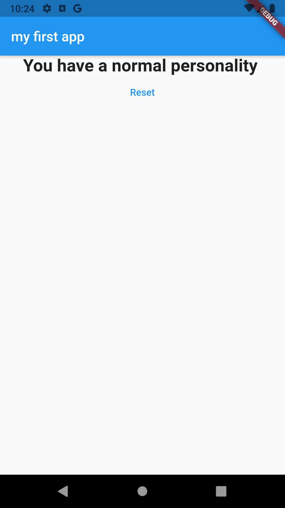

# flutter_App Quiz
# flutter_basics

A new Flutter project. that i make to learn the flutter basics and the Dart language base on udemy course named *** Flutter & Dart - The Complete Guide 2021 Edition ***

## what do i learn by bulding this project ?

1. what is flutter 
2. what is  Dart
3. the basic command of the terminal like flutter run , flutter doctor..etc
4. stateless and statefull Widget and the diffrent between them 
5. passing data between the  Widget
6. basic styling methoods and classes
7. reuesable  Widget
8. object (map) inside Dart
9. one of the way for typing the script 

### deployed link  ? 
still not deploy 

### want try the quiz ?
just clone and start the flutter app

